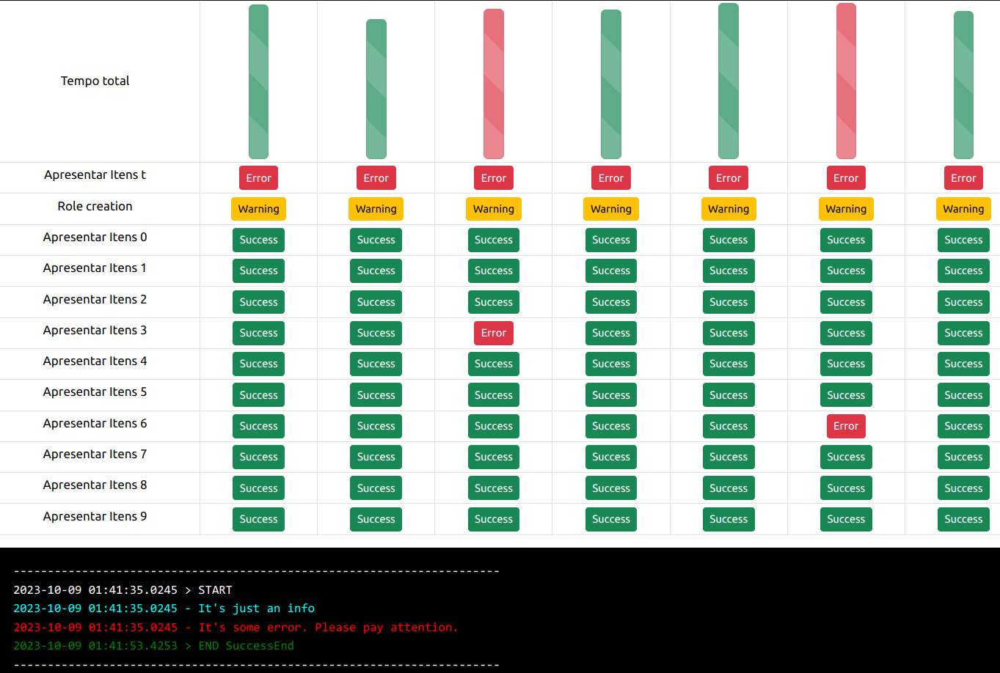

# DockerFlow

A system similar to Apache AirFlow interface, but based on Docker. It works by collecting Docker logs, and because that, it works with any programming languages.<br>
<br>

<br>
<br> 
### Using
Exemplica como iniciar
<br>

``` bash
docker compose up
```
This will start and collect Docker logs, but you must tell it when each task starts and ends. To do this, you must first choose your language and install the lib:


### C#
``` bash
dotnet add package DockerFlow
```

``` C#
string task_name = $"This is the name of your task";
Task task = new Task(task_name);
task.Start();

//this level is going show a message com DockerFlow web interface console
task.Info("Just an info");
task.Error("An error"); 
task.Debug("It will only appear in a non-production environment");


task.ErrorEnd("A message");     //this level is going a waning on task end
task.WaningEnd("A message");    //this level is going a crash on task
task.SuccessEnd();              //this level is going to finish a task normally
```
